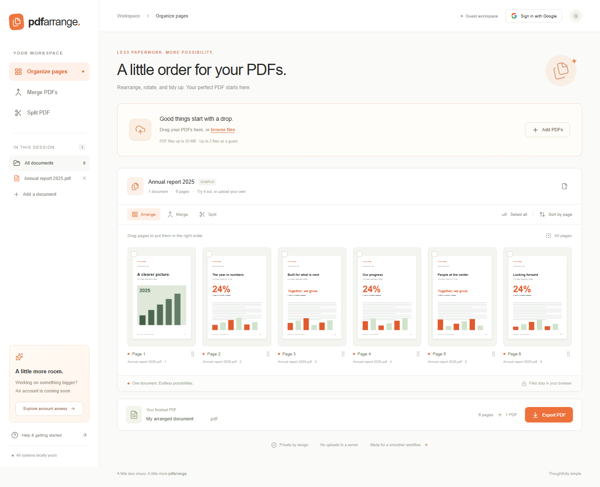
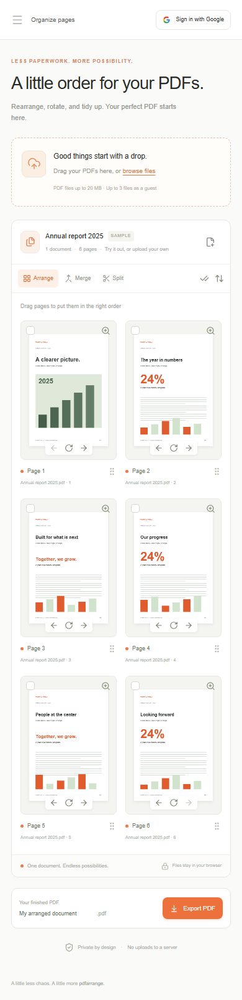

# PDFarrange

A little order for your PDFs. PDFarrange is a modern, privacy-first workspace for uploading, rearranging, rotating, splitting, and merging PDF pages, with an orange-and-white interface that works on desktop and mobile. Your files stay in your browser.

Built with Next.js App Router, Tailwind CSS v4, and shadcn/ui components built on Radix. Google sign-in and AWS cloud storage are planned. Use Node.js 22.13 or later.

## Screenshots

### Desktop



### Mobile



## Run locally

```sh
yarn install
yarn dev
```

Open http://localhost:3000. Production checks: `yarn lint` and `yarn build`.

## Working features

- Upload multiple PDFs through the file picker or drag and drop.
- Real page previews with PDF.js, including a larger preview dialog.
- Reorder pages by dragging or using accessible arrow buttons.
- Select, rotate, delete, and restore original source ordering with Sort by page.
- Arrange or merge all remaining pages into a PDF; Split extracts selected pages into a separate PDF.
- Edit the output filename and download a valid PDF using pdf-lib.
- A generated six-page sample document makes the workspace usable immediately. The first real upload replaces it.
- Responsive navigation, selection states, helpful notifications, and a getting-started dialog.

Guest mode currently limits uploads to 3 files, 25 total pages, and 20 MB per file. All PDF processing happens locally in the browser. Refreshing ends the session; download documents to keep them. Encrypted PDFs are unsupported.

## AWS and Google account integration

Account access and cloud persistence are not implemented. The sign-in dialog clearly indicates when Google authentication is not connected. To enable the authorization redirect, copy `.env.example` to `.env.local` and set `NEXT_PUBLIC_GOOGLE_AUTH_URL` to your AWS Cognito hosted authorization URL with the Google identity provider, client ID, scopes, response type, and registered redirect URI.

Before enabling accounts in production, implement the callback with OAuth state and PKCE validation, token/session handling, and server-side authorization. The environment variable only configures the redirect and does not create a signed-in session or change guest limits.

For cloud persistence, use private S3 objects and short-lived presigned URLs issued by an authenticated API. Define account quotas server-side and keep guests local, or add explicit guest upload policies. Do not put AWS credentials in public environment variables. Configure retention and deletion behavior before storing documents.

The app can be deployed on AWS Amplify Hosting or another Next.js-compatible AWS runtime. No AWS resources are provisioned by this project.
